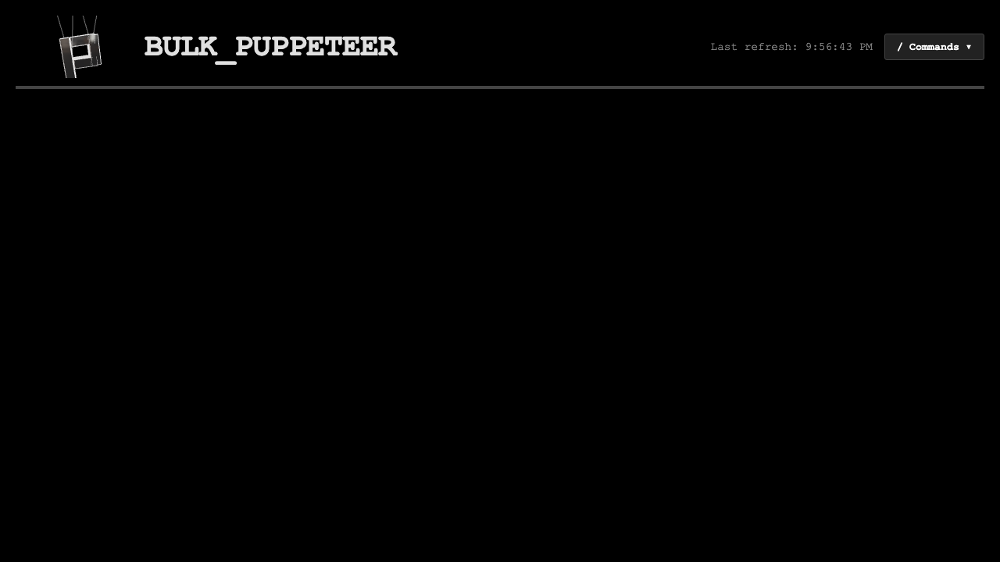

# BULK_PUPPETEER
**The Ultimate macOS Task Orchestrator & Gemini Swarm Engine (v3.5.1)**

---

## 1. Introduction & Philosophy
**BULK_PUPPETEER** is a native, Apple Silicon orchestration daemon. 

Instead of letting background processes bog down your terminal or silently fail, BULK_PUPPETEER runs quietly in your macOS Menu Bar as a headless `FastAPI` control plane. It acts as a highly secure "Execution Enclave", allowing you to dynamically throttle your CPU concurrency, manage task dependencies, and stream real-time Pseudo-Terminal (PTY) outputs—all without compromising your system's security to external network sniffers.

---

## 2. Installation & Quick Boot

### Step 1: Download the App
1. Go to the [Releases Page](https://github.com/AmirYassin/BULK_PUPPETEER-releases/releases) and download the latest `BULK_PUPPETEER_v3.x.x.dmg`.
2. Open the DMG and drag the `BULK_PUPPETEER` App directly into your `/Applications` folder.

### Step 2: The Autonomous Boot
Double-click the App from your `/Applications` folder. 

*   **The Security Enclave:** The daemon will silently generate a 64-character, cryptographically secure Bearer Token and lock it to your hard drive with strict `chmod 600` permissions.

---

## 3. The User Interfaces

### 1. The macOS Menu Bar
The daemon binds directly into the macOS WindowServer using the raw AppKit frameworks.
![Menu Bar Interface]

*   **Global Swarm Controls:** Click it to cleanly "Pause" or "Resume" all active tasks to instantly free up your CPU.
*   **Authentication:** Click **"Copy Session Token"**. This uses native macOS `pbcopy` to inject your secure enclave key directly into your clipboard (a notification banner will pop up to confirm).
*   **Self-Healing:** If you encounter heavy instability, hit "Restart Daemon" to execute a clean process memory replacement without leaving any zombie port locks.

### 2. The Web Dashboard
Click "Open Command Center" from the Menu Bar, or navigate to `http://127.0.0.1:8080`.


*   Paste your Session Token to unlock the dashboard.
*   **The Dark Mode PTY:** Watch your tasks execute in real-time with full ANSI-color support.
*   **Command Palette:** Press `/` anywhere on the dashboard to pull up the instant orchestration search bar.


---

## 4. The Agent-Native CLI (`swarm-cli`)
The absolute core of BULK_PUPPETEER is its End-to-End Encrypted (E2EE) command-line interface. 
All traffic between the CLI and the daemon is AES-128-CBC encrypted, mathematically protecting your AI prompts and payload data from local network sniffers.

*(Note: The `swarm-cli` alias is automatically injected into your `~/.zshrc` when the App boots. Open a fresh terminal to use it).*

### Global CLI Arguments
| Argument | Purpose | Default Value |
| :--- | :--- | :--- |
| `--port` | The local port the daemon is bound to. | `8080` |
| `--token` | Injects the active session token for API authorization and AES key derivation. | Auto-extracted |
| `--json` | Forces the CLI to bypass human-readable formatting and output pure JSON. | `False` |

### Orchestration Commands
| Command | Arguments | Purpose |
| :--- | :--- | :--- |
| `status` | None | Fetches the global DAG topology, concurrency limits, and active task states. |
| `add` | `<task_id> <prompt> [--cwd <path>] [--deps <csv>]` | Injects a new Gemini AI agent into the swarm. |
| `kill` | `<task_id>` | Terminates a specific task process group via `SIGKILL`. |
| `logs` | `<task_id>` | Establishes a secure bi-directional WebSocket PTY to interact with the task. |
| `get-workers`| None | Retrieves the current CPU concurrency limits. |
| `set-workers`| `<N>` | Dynamically throttles the maximum number of simultaneous tasks. |

---

## 5. The Ultimate A-to-Z Workflow
Here is how to go from absolute zero to running a parallel swarm of AI agents in 30 seconds.

**1. Authorize your terminal:**
*(Assuming you clicked "Copy Session Token" from the Menu Bar)*
```bash
export SWARM_TOKEN="<paste_token_here>"
```

**2. Throttle your CPU:**
*(Let's limit the daemon to 4 concurrent processes so your Mac doesn't overheat)*
```bash
swarm-cli set-workers 4
```

**3. Spawn the AI Swarm:**
*(The new `v3.5.1` CLI autonomously injects your terminal's current working directory, so the agents execute exactly where you are standing!)*
```bash
swarm-cli add DATA_BOT_A "write a python script named 'a.py' that prints Hello"
swarm-cli add DATA_BOT_B "write a python script named 'b.py' that prints World"
```

**4. Stream the Output Securely:**
*(Attach your terminal directly to the active PTY to watch the AI think)*
```bash
swarm-cli logs DATA_BOT_A
```

**5. Annihilate the Task:**
```bash
swarm-cli kill DATA_BOT_A
```

---

## 6. Advanced Integration (REST API)
For developers building external automations, the background daemon exposes a strictly typed REST API. All endpoints require the `Authorization: Bearer <token>` header.

*   `GET /api/status`: Fetch full orchestrator state.
*   `POST /api/tasks/add`: JSON payload injection.
*   `PUT /api/tasks/{id}?action=pause`: Trigger FSM state transitions.
*   `DELETE /api/tasks/{id}`: Purge task from memory.
*   `ws://.../ws/console/{id}`: Bi-directional PTY data streaming.
