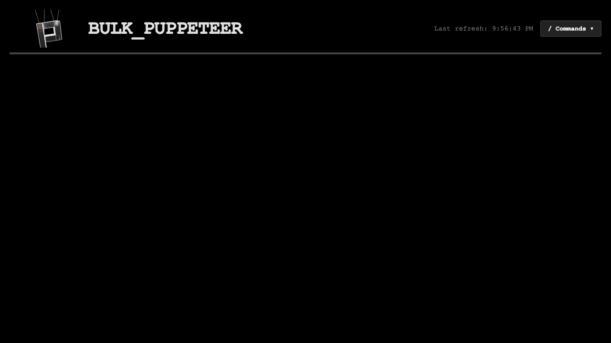

<p align="center">
  
</p>

<h1 align="center">BULK_PUPPETEER</h1>
<p align="center"><strong>v3.7.0</strong> — Task Orchestration Daemon for macOS Apple Silicon</p>

---

> [!CAUTION]
> **SPAWNED TASKS ARE KILLED AUTOMATICALLY, PLEASE RESUME TO ACTIVATE!**

---

## Table of Contents

- [What is BULK_PUPPETEER?](#what-is-bulk_puppeteer)
- [Installation](#installation)
- [Quick Start](#quick-start)
- [Core Concepts](#core-concepts)
- [Security Architecture](#security-architecture)
- [API Reference](#api-reference)
- [CLI Reference](#cli-reference)
- [User Interface](#user-interface)
- [Architecture](#architecture)
- [CI/CD & Headless Mode](#cicd--headless-mode)
- [Troubleshooting](#troubleshooting)
- [License](#license)

---

## What is BULK_PUPPETEER?

**BULK_PUPPETEER** is a framework-agnostic task orchestration daemon designed for macOS Apple Silicon. It runs as a background FastAPI service, managing concurrent shell tasks defined within Directed Acyclic Graphs (DAGs).

The system provides:
- A **native macOS Menu Bar app** (AppKit) for host-level management
- An **E2EE Command Line Interface** for task orchestration
- A **Web Dashboard** with real-time PTY streaming and a command palette
- An interactive **physics-based 3D logo** rendered via Three.js

---

## Installation

### Prerequisites

- macOS 13+ (Apple Silicon)
- Python 3.11+
- Xcode Command Line Tools (`xcode-select --install`)

### From DMG (macOS App)

1. Download the latest `.dmg` from [Releases](https://github.com/AmirYassin/BULK_PUPPETEER-releases/releases)
2. Drag `BULK_PUPPETEER.app` to `/Applications`
3. Launch the app — on first run, it automatically injects a `bulk-cli` alias into your `~/.zshrc` and `~/.bash_profile`
4. Restart your terminal (or run `source ~/.zshrc`)

The CLI is available as `bulk-cli` when installed via DMG.

### From Source

```bash
git clone https://github.com/AmirYassin/BULK_PUPPETEER.git
cd BULK_PUPPETEER
/usr/bin/pip3 install -e ".[dev]"
```

The CLI is available as `swarm-cli` when running from source.

> [!NOTE]
> **CLI naming:** `swarm-cli` (from source) and `bulk-cli` (from DMG) are the same tool. All examples below use `swarm-cli` — substitute `bulk-cli` if you installed via DMG.

### Post-Install: Environment Setup

> [!WARNING]
> **`$PATH` Isolation:** BULK_PUPPETEER runs as a native macOS AppKit daemon and **does not inherit your terminal's `$PATH`** (e.g., `~/.zshrc` or `/opt/homebrew/bin`).

To ensure the Swarm Engine can locate your CLI tools (`gemini`, `claude`, `aider`, `python`, `node`, etc.), create system-level symlinks:

```bash
sudo ln -s /opt/homebrew/bin/gemini /usr/local/bin/gemini
sudo ln -s /opt/homebrew/bin/claude /usr/local/bin/claude
sudo ln -s /opt/homebrew/bin/aider /usr/local/bin/aider
```

Click **"Restart Daemon"** in the Menu Bar after creating symlinks for them to take effect.

---

## Quick Start

### 1. Launch the App

```bash
# From source
./start_daemon.sh [manifest_path] [port]

# Or from /Applications (if installed via DMG)
open -a BULK_PUPPETEER
```

The daemon binds to `127.0.0.1:8080` and generates a session token at `.daemon.token`.

### 2. Copy the Session Token

Click the Menu Bar icon and select **"Copy Session Token"**, or:

```bash
export SWARM_TOKEN=$(cat .daemon.token)
```

> **Token auto-detection:** The CLI automatically looks for `.daemon.token` in your current working directory. You only need to export the token if running from a different directory, or override it with `--token`.

### 3. Spawn Tasks

> [!CAUTION]
> **Spawned tasks start in a killed state. You MUST resume them to activate!**

```bash
# Set max concurrent tasks (default: 3)
swarm-cli set-workers 4

# Spawn independent agents (default: Gemini)
swarm-cli add DATA_BOT_A "write a python script named 'a.py' that prints Hello"
swarm-cli add DATA_BOT_B "write a python script named 'b.py' that prints World"

# Spawn a dependent agent (waits for A and B)
swarm-cli add DATA_BOT_C "verify that a.py and b.py produce Hello World" --deps DATA_BOT_A,DATA_BOT_B

# Spawn an agent using Claude with the Sonnet variant
swarm-cli add CODE_REVIEW "review the changes in src/" --model claude --model-variant sonnet

# Spawn an agent using a specific Gemini model
swarm-cli add ANALYZER "analyze the codebase" --model gemini --model-variant gemini-2.5-pro

# Spawn an Aider agent
swarm-cli add REFACTOR "refactor the auth module" --model aider --model-variant gemini/gemini-2.5-pro

# Spawn a raw shell command (no model wrapping)
swarm-cli add HEALTH_CHECK "echo 'all good'" --model raw
```

The CLI automatically inherits your shell's working directory and preserves `.gemini` session history via dynamic `-r` flag injection. Think of spawning a task as "forking" your current terminal context.

### 4. Activate Tasks (Required)

Tasks are intentionally spawned in a dormant state to prevent sudden CPU overloads. You must trigger them to start:

- **Option A (Web Dashboard):** Open `http://127.0.0.1:8080` and click **Resume** on the task
- **Option B (REST API):**
  ```bash
  curl -X POST -H "Authorization: Bearer $SWARM_TOKEN" \
    "http://127.0.0.1:8080/api/tasks/resume/DATA_BOT_A"
  ```

### 5. Monitor & Control

```bash
# Stream live PTY output (maintains WebSocket until process ends or you disconnect)
swarm-cli logs DATA_BOT_C

# Check swarm status (human-readable)
swarm-cli status

# Check swarm status (machine-readable JSON, for scripts/agents)
swarm-cli status --json

# Kill a task
swarm-cli kill DATA_BOT_C
```

### 6. Stop the Daemon

```bash
./stop_daemon.sh
```

---

## Core Concepts

### Directed Acyclic Graph (DAG)

Tasks are not executed sequentially — they run dynamically based on dependency relationships. The engine uses **Kahn's Algorithm** to guarantee a cycle-free execution graph.

- A task with `depends_on` stays `BLOCKED` until all dependencies reach `COMPLETED`
- If a dependency fails (`FAILED`), dependent tasks cascade to failure automatically
- Tasks with no dependencies run immediately (subject to concurrency limits)

### Worker Concurrency

The engine uses an `asyncio.Semaphore` to limit how many tasks run simultaneously. **Default: 3 workers.** If 5 tasks are unblocked at once, 3 run immediately and 2 remain `QUEUED` until a worker slot opens.

```bash
# View current limit
swarm-cli get-workers

# Change it dynamically
swarm-cli set-workers 8
```

### Task Lifecycle (FSM)

Every task moves through a Finite State Machine with validated transitions:

```
BLOCKED → QUEUED → IN_PROGRESS → COMPLETED
                              → FAILED
                              → KILLED
COMPLETED / FAILED / KILLED → QUEUED (restart/retry)
```

Illegal state jumps raise `IllegalStateTransitionError`.

---

## Security Architecture

All local communication is secured with a three-layer protocol:

1. **Bearer Token Auth** — 64-char hex token generated via `os.urandom(32).hex()`, stored in `.daemon.token` (chmod 600)
2. **AES-128-CBC Encryption (Fernet)** — all CLI-to-daemon payloads are encrypted end-to-end, keyed from the session token
3. **CORS restricted to localhost** — the API only accepts cross-origin requests from `http://127.0.0.1:8080` and `http://localhost:8080`; external origins are blocked

The bearer token is never logged. Even local loopback traffic intercepted by other processes is unreadable.

---

## API Reference

All endpoints require: `Authorization: Bearer <64_char_hex_token>`

### REST

| Method | Endpoint | Purpose |
|--------|----------|---------|
| `GET` | `/api/tasks` | List all tasks with their current state |
| `GET` | `/api/status` | Global swarm status (concurrency, pause state, task count) |
| `POST` | `/api/tasks/add` | Inject a new task into the execution graph (dormant) |
| `POST` | `/api/tasks/resume/{id}` | Resume/restart a single dormant task |
| `POST` | `/api/tasks/kill/{id}` | Send SIGKILL to a specific task |
| `POST` | `/api/tasks/kill_all` | Emergency kill all active tasks |
| `POST` | `/api/tasks/pause_all` | Globally pause the swarm |
| `POST` | `/api/tasks/resume_swarm` | Globally resume the swarm |
| `POST` | `/api/tasks/resume_all` | Resume all tasks in a dormant state (FAILED/COMPLETED/KILLED) |
| `POST` | `/api/tasks/{id}/stdin` | Inject raw text into a task's stdin |
| `POST` | `/api/config/concurrency` | Update worker concurrency limit (restarts engine) |
| `PUT` | `/api/tasks/{id}` | Replace the configuration of a dormant task |
| `DELETE` | `/api/tasks/{id}` | Purge a dormant task from memory |
| `GET` | `/api/tasks/{id}/logs` | Retrieve the 2000-line output buffer for a task |
| `GET` | `/api/server_logs` | Tail the backend diagnostic log file |

### Task Payload Schema

```json
{
  "id": "BUILD_CORE",
  "cmd": "python3 build.py",
  "cwd": "/opt/app",
  "env": {"PRODUCTION": "1"},
  "depends_on": ["LINT", "TEST"],
  "use_pty": true
}
```

### WebSocket

| Endpoint | Purpose |
|----------|---------|
| `ws://.../ws/console/{id}` | Bi-directional PTY channel (stdout/stderr + keystrokes) |
| `ws://.../ws/server_logs` | Read-only daemon event stream |

---

## CLI Reference

> **Reminder:** Use `swarm-cli` (from source) or `bulk-cli` (from DMG). They are identical.

### Global Arguments

| Argument | Default | Purpose |
|----------|---------|---------|
| `--port` | `8080` | Daemon port (`1024-65535`) |
| `--token` | Auto from `.daemon.token` | Session token for auth + E2EE key derivation |
| `--json` | `false` | Machine-readable JSON output (for scripts and LLM agents) |

### Commands

| Command | Arguments | Purpose |
|---------|-----------|---------|
| `status` | — | Swarm topology and task states |
| `add` | `<id> <prompt> [--cwd] [--deps] [--model] [--model-variant]` | Spawn a task (with dynamic context injection) |
| `kill` | `<id>` | Terminate a task via SIGKILL |
| `resume` | `<id>` | Resume a dormant/killed task |
| `logs` | `<id>` | Attach to live PTY stream (last 2000 lines circular buffer) |
| `get-workers` | — | Show concurrency limit |
| `set-workers` | `<N>` | Set max concurrent tasks (restarts engine — kills active tasks) |

### Supported Models

| Model | Binary | Variants | Description |
|-------|--------|----------|-------------|
| `gemini` (default) | `gemini` | Any Gemini API model ID (`gemini-2.5-flash`, `gemini-2.5-pro`, `flash`, `pro`, etc.) | Google Gemini CLI |
| `claude` | `claude` | Strict allowlist: `sonnet`, `opus`, `haiku`, `sonnet[1m]`, `opus[1m]`, `opusplan`, plus specific full IDs (`claude-opus-4-6`, `claude-sonnet-4-6`, `claude-haiku-4-5`, etc.) | Anthropic Claude Code |
| `aider` | `aider` | Any LiteLLM model string (`gemini/gemini-2.5-pro`, `claude-sonnet-4-6`, `gpt-4o`, etc.) | AI pair programming |
| `raw` | — | — | Raw shell command (no wrapping) |

> **Model string validation:** Gemini and Aider accept any model string their respective CLIs support — the orchestrator passes them through without an allowlist. Claude validates against a known model list because Claude Code is strict about model name format.

### CLI Output Examples

**Human-readable (default):**
```bash
swarm-cli status
# Swarm Status: ACTIVE
# Concurrency: 3
# Total Tasks: 12
```

**Machine-readable (for agents/scripts):**
```bash
swarm-cli status --json
# {
#   "tasks": {
#     "build_frontend": {"status": "COMPLETED", "cmd": "npm run build", "return_code": 0}
#   },
#   "swarm": {"is_paused": false, "concurrency_limit": 3, "task_count": 1}
# }
```

> **Note on prompts:** The `add` command wraps your prompt in an AES-encrypted JSON payload. For complex prompts with nested quotes or long file paths, keep them concise or use single quotes internally to prevent JSON escape errors during transmission.

---

## User Interface

### macOS Menu Bar

The daemon integrates with macOS WindowServer via AppKit:
- **Pause/Resume All** — global task controls
- **Copy Session Token** — copies to clipboard with native notification
- **Restart Daemon** — clean `os.execv` process replacement

### Web Dashboard



- **Real-time PTY streaming** with scroll-lock for rapid output
- **Command Palette** — press `/` for keyboard-driven orchestration
- **Model Selector** — grouped dropdown with 15 model options + custom variant input
- **Model Badges** — color-coded task cards showing which AI model each task uses
- **3D Logo** — interactive physics-based marionette rendered in WebGL

---

## Architecture

```
src/bulk_puppeteer/core/
├── engine.py          # ExecutionEngine, TaskManager, polymorphic task hierarchy
├── api.py             # FastAPI app factory, REST + WebSocket, ASGI middleware
├── models.py          # Pydantic schemas (TaskDef, TaskState, TaskStatus)
├── config.py          # Immutable SwarmConfig (single source of truth)
├── fsm.py             # TaskStateMachine (legal transition adjacency list)
├── dag.py             # SwarmDAG (Kahn's Algorithm cycle detection)
├── events.py          # TelemetryBus (Observer pattern, decouples I/O from WS)
├── command_builder.py # Model registry + build_command() — maps model names to CLI templates
├── tray.py            # macOS Menu Bar (rumps + AppKit)
├── react.py           # ReActAgent (LLM-driven Reason+Act loop)
├── exceptions.py      # OrchestratorError → DAGCycleError, TaskExecutionError, PtyAllocationError
└── constants.py       # Shared constants
```

### Execution Flow

1. `__main__.py` parses args, builds `SwarmConfig`, calls `create_app(config)`, starts Uvicorn
2. `ExecutionEngine.load_manifest()` parses JSON manifest into `AbstractTask` objects, registers in `SwarmDAG`
3. `ExecutionEngine.start_all()` spawns one `asyncio.Task` per job
4. Each task: waits for DAG deps, acquires semaphore, executes via PTY or standard shell
5. All I/O routed through `TelemetryBus` to WebSocket subscribers
6. State transitions validated by `TaskStateMachine` — illegal jumps raise exceptions

### Task Types

- **`PtyInteractiveTask`** — OS-level PTY allocation for TTY-aware tools (vim, gemini, etc.)
- **`StandardShellTask`** — `asyncio.create_subprocess_shell` with pipes (when `use_pty: false`)

---

## CI/CD & Headless Mode

For CI/CD pipelines and environments without a display, bypass the Menu Bar integration:

```bash
# Start daemon headless (no AppKit, no Window Server required)
nohup python3 -m bulk_puppeteer --headless --port 9090 > daemon.log 2>&1 &
```

Then point the CLI to the custom port:

```bash
swarm-cli --port 9090 status
swarm-cli --port 9090 add BUILD "run the build" --deps LINT,TEST
```

---

## Troubleshooting

### Why is my task instantly showing as `KILLED`?

The `KILLED` status means the task's process is not currently running. This happens in three scenarios:

| Scenario | Cause | Fix |
|----------|-------|-----|
| **Default state** | You just added the task — it's waiting for you to resume | Hit **Resume** in the Dashboard or via the API |
| **Manual kill** | You stopped it with `swarm-cli kill` | Re-add and resume the task |
| **Subprocess boot failure** | The daemon can't find the executable (e.g., `gemini`) | Create a `/usr/local/bin` symlink and restart the daemon (see [Environment Setup](#post-install-environment-setup)) |

If a task instantly returns to `KILLED` after resume with empty logs, it's almost always the `$PATH` isolation issue.

### Connection Refused / 500 Error

- **Symptom:** `[ERROR] API Request Failed: None`
- **Cause:** The daemon is not running on the expected port.
- **Fix:** Ensure you launched the `.app` or ran `./start_daemon.sh`. Verify with `swarm-cli --port <PORT> status`.

### Authentication Failure

- **Symptom:** `[ERROR] API Request Failed: Unauthorized`
- **Cause:** The `.daemon.token` in your working directory doesn't match the daemon's active token, or the file is missing.
- **Fix:** Run `swarm-cli` from the same directory where the daemon was launched, or pass the correct token with `--token`.

### Task Not Found

- **Symptom:** `[ERROR] Failed to fetch logs for 'xyz'` (empty or 404)
- **Cause:** The task ID doesn't exist in the active DAG.
- **Fix:** Run `swarm-cli status` to see which task IDs are currently loaded.

---

## License

Copyright (c) 2026 Amir Yassin. All rights reserved.
