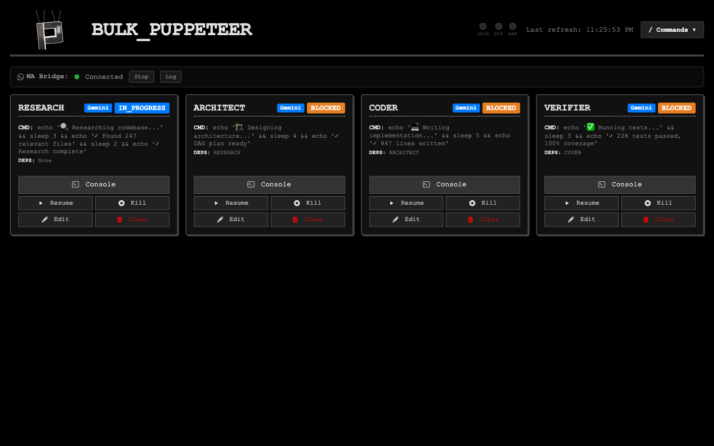
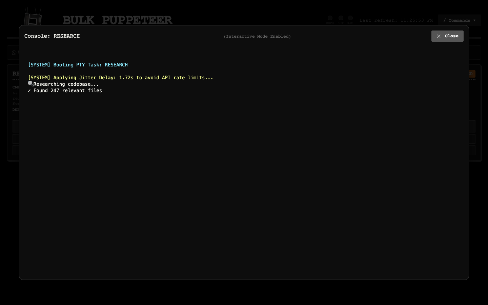
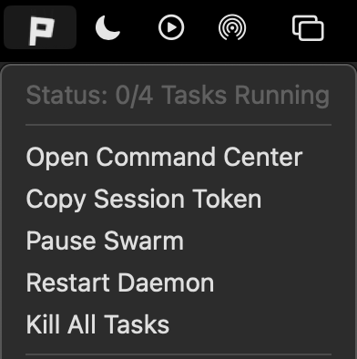
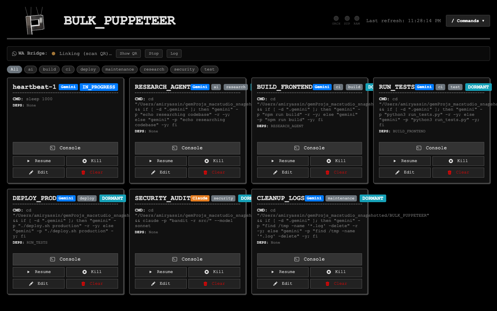
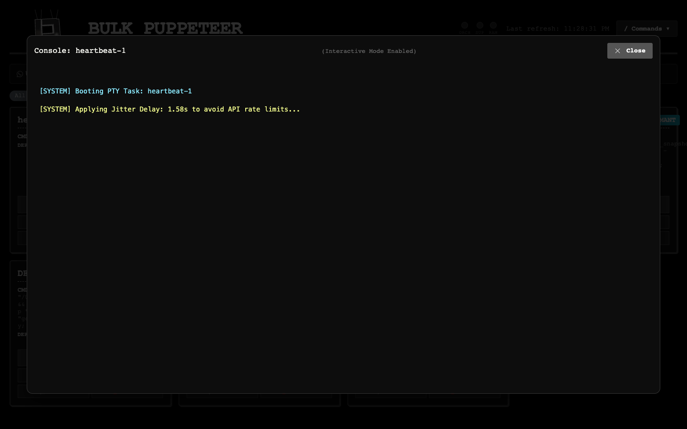

<p align="center">
  
</p>

<h1 align="center">BULK_PUPPETEER</h1>
<p align="center"><strong>v4.4.3</strong> — Task Orchestration Daemon for macOS Apple Silicon</p>

---

<p align="center">
  <strong>Chain AI agents and raw shell commands into dependency graphs</strong><br/>
  that execute concurrently, stream live PTY output to your browser,<br/>
  and respond to commands from WhatsApp.<br/><br/>
  <strong>No Docker. No cloud. Just your machine.</strong>
</p>

<p align="center">
  A persistent <strong>Orchestrator</strong> runs silently in the background — managing multiple <strong>Teams</strong>,<br/>
  each a named group of agents working in parallel on their assigned <strong>Tasks</strong>.<br/>
  Create, monitor, and edit teams and tasks in real time from the Web Dashboard, CLI,<br/>
  or directly from <strong>WhatsApp</strong>. Spin up a research team, chain it into a coding team,<br/>
  watch the output stream live. <strong>All from your phone.</strong>
</p>

<p align="center">
  
</p>



<table>
  <tr>
    <td width="33%"><br/><sub><b>Live PTY Streaming</b></sub></td>
    <td width="33%"><br/><sub><b>Native macOS Menu Bar</b></sub></td>
    <td width="33%"><br/><sub><b>WhatsApp Control</b></sub></td>
  </tr>
</table>

---

> [!CAUTION]
> **SPAWNED TASKS START IN DORMANT STATE — RESUME TO ACTIVATE!**

---

## Table of Contents

- [What is BULK_PUPPETEER?](#what-is-bulk_puppeteer)
- [Installation](#installation)
- [Quick Start](#quick-start)
- [Core Concepts](#core-concepts)
- [Security Architecture](#security-architecture)
- [Configuration](#configuration)
- [API Reference](#api-reference)
- [CLI Reference](#cli-reference)
- [WhatsApp Bridge Integration](#whatsapp-bridge-integration)
- [User Interface](#user-interface)
- [Architecture](#architecture)
- [CI/CD & Headless Mode](#cicd--headless-mode)
- [Troubleshooting](#troubleshooting)
- [License](#license)

---

## What is BULK_PUPPETEER?

**BULK_PUPPETEER** is a framework-agnostic task orchestration daemon designed for macOS Apple Silicon. It runs as a background FastAPI service, managing concurrent shell tasks defined within Directed Acyclic Graphs (DAGs).

---

## Installation

### Prerequisites

- macOS 13+ (Apple Silicon)
- Python 3.9+
- Xcode Command Line Tools (`xcode-select --install`)

### From DMG (macOS App)

1. Download [`BULK_PUPPETEER_v4.4.3.dmg`](https://github.com/AmirYassin/BULK_PUPPETEER-releases/releases/download/v4.4.3/BULK_PUPPETEER_v4.4.3.dmg)
2. Drag `BULK_PUPPETEER.app` to `/Applications`
3. Launch the app — on first run, it automatically injects a `bulk-cli` alias into your `~/.zshrc` and `~/.bash_profile`
4. Restart your terminal (or run `source ~/.zshrc`)

The CLI is available as `bulk-cli` when installed via DMG.

> [!NOTE]
> **CLI naming:** `swarm-cli` (from source) and `bulk-cli` (from DMG) are the same tool. All examples below use `swarm-cli` — substitute `bulk-cli` if you installed via DMG.

### From Source

```bash
git clone https://github.com/AmirYassin/BULK_PUPPETEER.git
cd BULK_PUPPETEER
/usr/bin/pip3 install -e ".[dev]"
```

The CLI is available as `swarm-cli` when running from source.

### Post-Install: Environment Setup

> [!WARNING]
> **`$PATH` Isolation:** BULK_PUPPETEER runs as a native macOS AppKit daemon and **does not inherit your terminal's `$PATH`** (e.g., `~/.zshrc` or `/opt/homebrew/bin`).

To ensure the Swarm Engine can locate your CLI tools (`gemini`, `python`, `node`, etc.), create system-level symlinks:

```bash
sudo ln -s /opt/homebrew/bin/gemini /usr/local/bin/gemini
```

Click **"Restart Daemon"** in the Menu Bar after creating symlinks for them to take effect.

### First-Run Setup

After launching the app for the first time, complete these steps from the Menu Bar icon:

1. **Set your WhatsApp number** — Menu Bar > **"Set WhatsApp Number…"** (or set `BP_USER_PHONE` env var before launch). The number is saved to `~/Library/Application Support/BULK_PUPPETEER/.user_jid` and takes effect immediately — no restart required.
2. **Set your Gemini API key** — Menu Bar > **"Set Gemini API Key…"** (or set `GEMINI_API_KEY` env var). If the key in the environment and the saved file differ, the app will alert you with a fingerprint comparison dialog.
3. **Check the log file** — all daemon output is written to `~/Library/Application Support/BULK_PUPPETEER/server.log`.

All writable runtime state (SQLite database, session token, agent profiles) is stored in `~/Library/Application Support/BULK_PUPPETEER/`.

### Build macOS App (DMG)

```bash
# Dev build (LTO disabled, Nuitka cache enabled — fast iteration)
./build_release_cached.sh

# Production build (full LTO + notarization)
PRODUCTION=1 ./build_release.sh
```

Output: `dist/BULK_PUPPETEER_v4.4.3.dmg`

### Run Tests

```bash
# Full suite (backend + Playwright E2E)
/usr/bin/python3 run_tests.py

# Backend only
/usr/bin/python3 -m pytest -v -p no:playwright -n auto --timeout=40 \
  --ignore=TESTS/AUTO_UI --ignore=TESTS/backend/test_macos_integration.py TESTS/backend/

# E2E only
/usr/bin/python3 -m pytest -v -n auto --timeout=40 TESTS/AUTO_UI/
```

---

## Quick Start

### 1. Launch the App

```bash
# From source
./start_daemon.sh [manifest_path] [port]

# Or from /Applications (if installed via DMG)
open -a BULK_PUPPETEER
```

The daemon binds to `127.0.0.1:8080` and generates a session token at `.daemon.token`.

### 2. Copy the Session Token

Click the Menu Bar icon and select **"Copy Session Token"**, or:

```bash
export SWARM_TOKEN=$(cat .daemon.token)
```

> **Token auto-detection:** The CLI automatically looks for `.daemon.token` in your current working directory. You only need to export the token if running from a different directory, or override it with `--token`.

### 3. Spawn Tasks

> [!CAUTION]
> **Spawned tasks start in DORMANT state. You MUST resume them to activate!** Use `--run` to start immediately.

```bash
# Set max concurrent tasks (default: 3)
swarm-cli set-workers 4

# Spawn independent agents (dormant by default — must resume)
swarm-cli add DATA_BOT_A "write a python script named 'a.py' that prints Hello"
swarm-cli add DATA_BOT_B "write a python script named 'b.py' that prints World"

# Spawn and immediately start (--run skips DORMANT state)
swarm-cli add DATA_BOT_C "verify that a.py and b.py produce Hello World" --deps DATA_BOT_A,DATA_BOT_B --run

# Spawn an agent using Claude with the Sonnet variant
swarm-cli add CODE_REVIEW "review the changes in src/" --model claude --model-variant sonnet

# Spawn a raw shell command (no model wrapping)
swarm-cli add HEALTH_CHECK "echo 'all good'" --model raw
```

The CLI automatically inherits your shell's working directory and preserves `.gemini` session history via dynamic `-r` flag injection. Think of spawning a task as "forking" your current terminal context.

### 4. Activate Tasks (Required)

Tasks are intentionally spawned in a dormant state to prevent sudden CPU overloads. You must trigger them to start:

- **Option A (Web Dashboard):** Open `http://127.0.0.1:8080` and click **Resume** on the task
- **Option B (CLI):**
  ```bash
  swarm-cli resume DATA_BOT_A
  ```
- **Option C (REST API):**
  ```bash
  curl -X POST -H "Authorization: Bearer $SWARM_TOKEN" \
    "http://127.0.0.1:8080/api/tasks/resume/DATA_BOT_A"
  ```

### 5. Monitor & Control

```bash
# Stream live PTY output (maintains WebSocket until process ends or you disconnect)
swarm-cli logs DATA_BOT_C

# Check swarm status (human-readable)
swarm-cli status

# Check swarm status (machine-readable JSON, for scripts/agents)
swarm-cli status --json

# Kill a task
swarm-cli kill DATA_BOT_C

# Pause the entire swarm
swarm-cli pause

# Resume the swarm
swarm-cli resume-swarm

# Resume all dormant tasks
swarm-cli resume-all

# Send input to a task's stdin
swarm-cli stdin MY_TASK "yes"

# Delete a completed task
swarm-cli delete OLD_TASK

# View backend logs
swarm-cli server-logs --tail 200
```

### 6. Stop the Daemon

```bash
./stop_daemon.sh
```

---

## What's New in v4.4.3

- **Chat history preservation** — the AI remembers conversation context within a session. History survives crash restarts automatically. Switching models clears the history to avoid cross-model context bleed.
- **Orchestrator agent spawning** — the `veteran-wa-orchestrator` swarm profile now ships with a full guide for spawning Gemini and Claude sub-agents from within an orchestration session.
- **User Identity (WhatsApp number)** — set your phone number via Menu Bar > **"Set WhatsApp Number…"**. Saved to `~/Library/Application Support/BULK_PUPPETEER/.user_jid`, active immediately in-process with no restart required. Also configurable via the `BP_USER_PHONE` env var.
- **SSL certificate fix for .app bundle** — `paths.py` monkey-patches `certifi` at startup so that `httpx` and `google-genai` resolve SSL correctly after installation from DMG, where the system Python cert bundle is not available.
- **Gemini API key mismatch detection** — if the `GEMINI_API_KEY` env var and the saved key file contain different keys, a tray dialog appears with a fingerprint comparison so you can resolve the conflict before the daemon starts making API calls.
- **WhatsApp bridge auth state machine** — bridge authentication is now driven by stdout parsing against a well-defined state machine, replacing the previous HTTP polling approach that produced false-positive auth failures.
- **Unified writable state directory** — SQLite database, session token, and agent profiles all live under `~/Library/Application Support/BULK_PUPPETEER/`, consistent with macOS sandboxing conventions.

## What's New in v4.0.0 (The SOTA iTerm & Rate-Limit Upgrade)

- **iTerm-in-Browser UI:** Complete aesthetic overhaul of the web terminal. The console now features a strict native monospace stack, dark-mode 12px rounded modal styling, and rigorous scroll-lock tolerances that replicate a native macOS iTerm2 experience directly inside the browser.
- **Concurrency Burst Mitigation (Execution Jitter):** The backend Execution Engine now employs a mathematically randomized `1.0-8.0s` startup jitter. When unleashing a swarm of agents simultaneously, this architectural mechanism cleanly staggers subprocess initialization, mathematically circumventing strict LLM API Request-Per-Second (429) rate limits.
- **JSON WebSocket Multiplexing:** Refactored the frontend-to-backend pipeline to use a scalable JSON message protocol (`{"type": "input", "data": "..."}` and `{"type": "resize"}`), breaking away from legacy raw-text buffering.
- **SIGWINCH Window Resizing:** The terminal viewport now actively synchronizes its dimensions with the underlying macOS kernel. Resizing the browser actively redraws terminal apps (like `top` or `vim`) in real-time.
- **TrueColor (256) PTY Injection:** The engine now strictly enforces `TERM=xterm-256color` and explicitly allocates a master/slave pseudo-terminal, ensuring that high-fidelity UI apps like the Gemini CLI render flawlessly.

## What's New in v3.8.0

- **DORMANT state** — dynamically added tasks now start in `DORMANT` instead of overloading `KILLED`. Clear semantic distinction between "not yet started" and "user terminated"
- **`--run` flag** — `swarm-cli add <id> <prompt> --run` starts the task immediately, skipping DORMANT state
- **Hot-resize concurrency** — `set-workers` swaps the semaphore in-place. Running tasks are no longer killed and the manifest is no longer reloaded
- **Shell escaping hardening** — `_escape_for_shell()` now handles `!` (bash history expansion), `\n`, `\r`, and null bytes
- **PTY EIO resilience** — graceful handling of `OSError(EIO)` when the PTY slave closes before the read loop
- **Exit code hints** — failed tasks with exit code 127 or 126 now include diagnostic hints ("command not found", "permission denied") in their log buffer
- **`SWARM_TOKEN` env var** — CLI checks `SWARM_TOKEN` environment variable before falling back to `.daemon.token` file
- **`--stable-token`** — daemon flag to reuse existing `.daemon.token` across restarts (avoids breaking existing agent connections)
- **DORMANT badge** — Web Dashboard renders DORMANT tasks with a teal status badge

### What's New in v3.7.0

- **Full CLI coverage** — all 16 REST API endpoints now have `swarm-cli` commands (was 8)
- **`swarm-cli resume`** — resume dormant/killed tasks from the CLI (previously dashboard-only)
- **Multi-model support** — `--model` and `--model-variant` flags on `swarm-cli add` (gemini, claude, aider, raw)
- **8 new commands** — `kill-all`, `pause`, `resume-swarm`, `resume-all`, `stdin`, `edit`, `delete`, `server-logs`
- **Security hardening** — expanded model variant validation, strict Claude allowlist

---

## Core Concepts

### Directed Acyclic Graph (DAG)

Tasks are not executed sequentially — they run dynamically based on dependency relationships. The engine uses **Kahn's Algorithm** to guarantee a cycle-free execution graph.

- A task with `depends_on` stays `BLOCKED` until all dependencies reach `COMPLETED`
- If a dependency fails (`FAILED`), dependent tasks cascade to failure automatically
- Tasks with no dependencies run immediately (subject to concurrency limits)

### Worker Concurrency

The engine uses an `asyncio.Semaphore` to limit how many tasks run simultaneously. **Default: 3 workers.** If 5 tasks are unblocked at once, 3 run immediately and 2 remain `QUEUED` until a worker slot opens.

To prevent high-concurrency swarms from tripping LLM API burst rate limits (e.g., `429 Too Many Requests`), the Execution Engine employs an automated `1.0-8.0s` startup jitter. This cleanly staggers the `fork/exec` calls across the time window, keeping burst spikes below the server's radar.

```bash
# View current limit
swarm-cli get-workers

# Hot-resize (running tasks are NOT killed — takes effect for new task scheduling)
swarm-cli set-workers 8
```

### Task Lifecycle (FSM)

Every task moves through a Finite State Machine with validated transitions:

```
DORMANT → QUEUED → IN_PROGRESS → COMPLETED
                               → FAILED
                               → KILLED
BLOCKED → QUEUED (when dependencies complete)
COMPLETED / FAILED / KILLED / DORMANT → QUEUED (restart/retry)
```

> **DORMANT** is the default state for dynamically added tasks. It indicates the task is registered but not yet scheduled. Use `resume` or add with `--run` to activate.

Illegal state jumps raise `IllegalStateTransitionError`.

### Multi-Model Support

The `--model` flag selects the AI backend. The `--model-variant` flag specifies the exact checkpoint.

| Model | `--model` value | Example variants |
|-------|-----------------|-----------------|
| Google Gemini | `gemini` | `gemini-2.5-flash`, `gemini-2.5-pro`, `flash`, `pro` |
| Anthropic Claude | `claude` | `sonnet`, `opus`, `haiku`, `claude-sonnet-4-6`, `claude-opus-4-6` |
| Aider | `aider` | `gemini/gemini-2.5-pro`, `claude-sonnet-4-6`, `gpt-4o` |
| Raw shell | `raw` | _(none)_ |

```bash
swarm-cli add TASK1 "Fix the bug in auth.py" --model gemini --model-variant gemini-2.5-flash --run
swarm-cli add TASK2 "Review TASK1 output" --model claude --model-variant sonnet --deps TASK1 --run
```

> **Model string validation:** Gemini and Aider accept any model string their respective CLIs support. Claude validates against a strict allowlist because Claude Code is strict about model name format.

### Agent Profiles

Profiles are pre-configured YAML personas stored in `~/Library/Application Support/BULK_PUPPETEER/profiles/`. They set the agent's system prompt, allowed tools, and behavior. Pass a profile name with `--profile`.

```bash
swarm-cli add RESEARCH "Investigate the codebase" --profile veteran-researcher --run
swarm-cli add ARCH "Design the solution" --profile veteran-architect --deps RESEARCH --run
swarm-cli add ORCH "Orchestrate responses via WhatsApp" --profile veteran-wa-orchestrator --run
```

**Built-in profiles:** `veteran-architect`, `veteran-researcher`, `senior-dev`, `debugger`, `security-auditor`, `veteran-wa-orchestrator`, and more.

Profile YAML format (create custom profiles):
```yaml
name: my-profile
description: "Custom agent persona"
model: gemini-2.5-pro
system_prompt: |
  You are a specialized agent for ...
tools:
  - read_file
  - write_file
  - bash
```

### Named Teams

Teams are logical groups of agents that can be started or stopped together. Define a team as a set of task IDs with a shared team name. Teams are managed via the WhatsApp bridge or the orchestrator.

```bash
# Start a team named "infra-audit"
# (via WhatsApp: send "start infra-audit")

# Stop a team
# (via WhatsApp: send "kill infra-audit")
```

See [WhatsApp Supported Commands](#supported-commands) for the full team command list.

### Task Tags and Filtering

Tags are free-form labels attached to tasks for grouping and filtering. Pass a comma-separated list with `--tags`.

```bash
swarm-cli add T1 "run linter" --tags "ci,lint" --run
swarm-cli add T2 "run tests" --tags "ci,test" --run
```

In the Web Dashboard, a tag filter bar appears automatically when any task has tags. Click a tag badge to filter the task grid to only tasks with that tag.

### PTY Interactive Terminal

Tasks that require a real terminal (interactive shells, `vim`, `less`, `gemini` CLI, etc.) use PTY mode. Set `"use_pty": true` in the task config. The Web Dashboard streams full TrueColor `xterm-256color` output and supports terminal resize via SIGWINCH.

```bash
# PTY is automatically enabled for gemini and claude models.
# For raw or aider tasks that need a terminal, add use_pty explicitly:
swarm-cli add INTERACTIVE "python3 -i script.py" --model raw --run
# Then use the Web Dashboard terminal to interact with it.
```

---

## Security Architecture

All local communication is secured with a three-layer protocol:

1. **Bearer Token Auth** — 64-char hex token generated via `os.urandom(32).hex()`, stored in `.daemon.token` (chmod 600)
2. **AES-128-CBC Encryption (Fernet)** — all CLI-to-daemon payloads are encrypted end-to-end, keyed from the session token
3. **CORS restricted to localhost** — the API only accepts cross-origin requests from `http://127.0.0.1:8080` and `http://localhost:8080`; external origins are blocked

The bearer token is never logged. Even local loopback traffic intercepted by other processes is unreadable.

### WebSocket Authentication

WebSocket connections authenticate via query parameter: `?token=<token>`.

The `/whatsapp/webhook` inbound endpoint requires either a valid Bearer token **or** a request originating from localhost (`verify_local_or_token`). Unauthenticated webhook posts from external addresses are rejected with HTTP 401.

### Shell Injection Prevention (`_validate_command`)

Before executing any task, `_validate_command()` scans the command string for dangerous shell metacharacters: `;`, `|`, `&`, `$`, `` ` ``, `\n`, `\r`. Commands containing any of these characters are rejected with a `ValueError` before a subprocess is spawned. This applies to both `StandardShellTask` and `PtyInteractiveTask`.

### Workspace Root Path Validation

The `SwarmConfig.workspace_root` field defines a spatial security boundary. When a task's `cwd` is set, the API resolves both the workspace root and the target path via `os.path.realpath()` and verifies that the target is inside the workspace using `os.path.commonpath()`. Symlink-based escape attempts are caught and rejected with HTTP 400 (`Spatial Escape Detected`).

### Orchestrator Preflight Checks

Before the orchestrator's `poll_loop` activates, `run_agent_settings_preflight()` validates that `AgentSettings.email` and `AgentSettings.phone` are present and well-formed. On success it sets `SwarmConfig.orchestrator_ready = True`. The macOS Menu Bar settings dialog shows a live `✓` / `○` indicator reflecting this state.

---

## Configuration

The daemon accepts the following `SwarmConfig` fields, settable via CLI flags or programmatically:

| Field | Type | Default | Description |
|-------|------|---------|-------------|
| `port` | `int` | `8080` | API bind port |
| `host` | `str` | `127.0.0.1` | API bind address |
| `concurrency` | `int` | `3` | Worker pool capacity (hot-resizable via `set-workers`) |
| `manifest_path` | `str` | `sample_tasks.json` | Path to the task JSON manifest |
| `log_file` | `str` | `server.log` | Path to the primary diagnostic log |
| `token` | `str` | _(generated)_ | Bearer token for authentication; auto-generated by `start_daemon.sh` |
| `verbose` | `bool` | `False` | Enable debug-level logging |
| `enable_state_cache` | `bool` | `True` | Enable local state caching |
| `state_cache_file` | `str` | `.com.apple.xpc.state` | Path to the local state cache file |
| `workspace_root` | `str` | _(CWD)_ | Safe directory boundary for task execution |
| `orchestrator_ready` | `bool` | `False` | Set to `True` by preflight checks when email/phone are valid |

**Removed fields (do not use):** `enable_remote_optimization`, `garbage_collector`. These were removed in v4.x and are no longer accepted.

### Log File Location

When running as a `.app` bundle (installed via DMG), stdout is suppressed by macOS. All logs are written to:

```
~/Library/Application Support/BULK_PUPPETEER/server.log
```

When running from source, `server.log` is written to the current working directory by default.

### Gemini API Key Resolution

The daemon resolves the Gemini API key in this order (first hit wins):

1. `GEMINI_API_KEY` environment variable
2. `GOOGLE_API_KEY` environment variable
3. `~/Library/Application Support/BULK_PUPPETEER/.gemini_key` file (mode `0600`)

If an env var and the saved file key are both present but differ, a `WARNING` is logged at startup and the tray menu bar shows `⚠ Mismatch`. A native macOS notification also fires. The env var always wins; to stop it from shadowing the file key, unset it (`unset GEMINI_API_KEY`) and restart the daemon.

---

## API Reference

All endpoints require: `Authorization: Bearer <64_char_hex_token>`

### REST

| Method | Endpoint | Auth | Purpose |
|--------|----------|------|---------|
| `GET` | `/api/tasks` | Token | List all tasks with their current state |
| `GET` | `/api/status` | Token | Global swarm status (concurrency, pause state, task count) |
| `POST` | `/api/tasks/add` | Token | Inject a new task (DORMANT by default, or auto-start with `auto_start: true`) |
| `POST` | `/api/tasks/resume/{id}` | Token | Resume/restart a single dormant task |
| `POST` | `/api/tasks/kill/{id}` | Token | Send SIGKILL to a specific task |
| `POST` | `/api/tasks/kill_all` | Token | Emergency kill all active tasks |
| `POST` | `/api/tasks/pause_all` | Token | Globally pause the swarm |
| `POST` | `/api/tasks/resume_swarm` | Token | Globally resume the swarm |
| `POST` | `/api/tasks/resume_all` | Token | Resume all dormant tasks (DORMANT/FAILED/COMPLETED/KILLED) |
| `POST` | `/api/tasks/{id}/stdin` | Token | Inject raw text into a task's stdin |
| `POST` | `/api/config/concurrency` | Token | Hot-resize worker concurrency (no restart, running tasks unaffected) |
| `PUT` | `/api/tasks/{id}` | Token | Replace the configuration of a dormant task |
| `DELETE` | `/api/tasks/{id}` | Token | Purge a dormant task from memory |
| `GET` | `/api/tasks/{id}/logs` | Token | Retrieve the 2000-line output buffer for a task |
| `GET` | `/api/server_logs` | Token | Tail the backend diagnostic log file |
| `GET` | `/api/test_files` | Token | List all test files |
| `GET` | `/api/wa/status` | None | WhatsApp bridge status |
| `POST` | `/api/wa/start` | Token | Start WhatsApp bridge |
| `POST` | `/api/wa/stop` | Token | Stop WhatsApp bridge |
| `GET` | `/api/wa/events` | None | WhatsApp bridge SSE event stream |
| `GET` | `/wa/qr` | None | WhatsApp QR code page |
| `POST` | `/whatsapp/webhook` | Local or Token | Inbound WA webhook |

### Task Payload Schema

```json
{
  "id": "BUILD_CORE",
  "cmd": "python3 build.py",
  "cwd": "/opt/app",
  "env": {"PRODUCTION": "1"},
  "depends_on": ["LINT", "TEST"],
  "use_pty": true,
  "tags": ["ci", "build"],
  "model": "gemini",
  "model_variant": "gemini-2.5-flash",
  "profile": "senior-dev"
}
```

### WebSocket

| Endpoint | Auth | Purpose |
|----------|------|---------|
| `ws://.../ws/console/{id}?token=<token>` | Token | Bi-directional PTY channel (stdout/stderr + keystrokes) |
| `ws://.../ws/server_logs?token=<token>` | Token | Read-only daemon event stream |

---

## CLI Reference

### Daemon (`bulk-puppeteer`)

The daemon is started via `./start_daemon.sh` or directly as a Python module. All flags are optional; defaults are shown below.

```
bulk-puppeteer [OPTIONS]
```

| Flag | Type | Default | Description |
|------|------|---------|-------------|
| `--manifest` | str | `sample_tasks.json` | Path to the JSON task manifest loaded at startup. |
| `--port` | int | `8080` | TCP port for the API server. |
| `--workers` | int | `3` | Maximum number of concurrently executing tasks. |
| `--token` | str | _(generated)_ | Bearer token for API auth. Auto-generated and written to `.daemon.token` if omitted. |
| `--verbose` | flag | `false` | Enable DEBUG-level logging. |
| `--headless` | flag | `false` | Run without the macOS AppKit Menu Bar. Required for CI/CD and Linux environments. |
| `--stable-token` | flag | `false` | Reuse the existing `.daemon.token` if present instead of generating a new one on each start. |

**Example invocations:**

```bash
# Default (Menu Bar + API on port 8080)
./start_daemon.sh

# Headless mode (CI/CD, no AppKit)
python3 -m bulk_puppeteer --headless --port 8080

# Custom manifest, more workers, reuse token
python3 -m bulk_puppeteer --manifest tasks.json --workers 8 --stable-token

# Verbose debug logging
python3 -m bulk_puppeteer --verbose --headless
```

### Swarm CLI (`swarm-cli` / `bulk-cli`)

> **Reminder:** Use `swarm-cli` (from source) or `bulk-cli` (from DMG). They are identical.

All commands require the daemon to be running. The token is auto-loaded from the `SWARM_TOKEN` environment variable or the `.daemon.token` file in the current working directory.

#### Global Arguments

| Argument | Default | Purpose |
|----------|---------|---------|
| `--port` | `8080` | Daemon port (`1024-65535`) |
| `--token` | Auto from `.daemon.token` or `$SWARM_TOKEN` | Session token for auth + E2EE key derivation |
| `--json` | `false` | Machine-readable JSON output (e.g., `bulk-cli status --json \| jq '.tasks'`) |

#### Commands

| Command | Arguments | Purpose |
|---------|-----------|---------|
| `status` | — | Swarm topology and task states |
| `add` | `<id> <prompt> [flags]` | Spawn a task (DORMANT by default; `--run` starts immediately) |
| `kill` | `<id>` | Terminate a task via SIGKILL |
| `resume` | `<id>` | Resume a dormant/killed task |
| `kill-all` | — | Emergency kill all active tasks |
| `pause` | — | Globally pause the swarm |
| `resume-swarm` | — | Globally resume the swarm |
| `resume-all` | — | Resume all dormant tasks (DORMANT/KILLED/FAILED/COMPLETED) |
| `stdin` | `<id> <text>` | Send raw text to a task's stdin |
| `edit` | `<id> <json>` | Replace config of a dormant task |
| `delete` | `<id>` | Purge a dormant task from memory |
| `server-logs` | `[--tail N]` | Tail backend diagnostic logs |
| `logs` | `<id>` | Attach to live PTY stream (last 2000 lines circular buffer) |
| `get-workers` | — | Show concurrency limit |
| `set-workers` | `<N>` | Hot-resize max concurrent tasks (running tasks unaffected) |

#### `add` Flags

| Flag | Default | Description |
|------|---------|-------------|
| `--model` | `gemini` | AI backend: `gemini`, `claude`, `aider`, `raw` |
| `--model-variant` | _(none)_ | Model checkpoint, e.g. `gemini-2.5-flash`, `sonnet` |
| `--profile` | _(none)_ | Agent profile name (YAML persona from profiles directory) |
| `--deps` | _(none)_ | Comma-separated upstream task IDs |
| `--cwd` | current dir | Working directory for the task |
| `--tags` | _(none)_ | Comma-separated tags, e.g. `research,prod` |
| `--run` | `false` | Start the task immediately instead of leaving it DORMANT |

#### CLI Output Examples

**Human-readable (default):**
```bash
swarm-cli status
# Swarm Status: ACTIVE
# Concurrency: 3
# Total Tasks: 12
```

**Machine-readable (for agents/scripts):**
```bash
swarm-cli status --json
# {
#   "tasks": {
#     "build_frontend": {"status": "COMPLETED", "cmd": "npm run build", "return_code": 0}
#   },
#   "swarm": {"is_paused": false, "concurrency_limit": 3, "task_count": 1}
# }
```

> **Note on prompts:** The `add` command wraps your prompt in an AES-encrypted JSON payload. For complex prompts with nested quotes or long file paths, keep them concise or use single quotes internally to prevent JSON escape errors during transmission.

---

## WhatsApp Bridge Integration

BULK_PUPPETEER includes an optional WhatsApp bridge that routes your inbound messages to a persistent Gemini AI orchestrator. Send a message to yourself on WhatsApp and the AI responds — it can spawn sub-agents, run shell tasks, manage the DAG, and report back, all from your phone.

### How It Works

```
Your WhatsApp → Bridge (Go binary) → BULK_PUPPETEER daemon → Gemini AI (veteran-wa-orchestrator)
                                                            ↓
                                              Sub-agents (gemini / claude / aider)
                                                            ↓
                                              WA reply → Your WhatsApp
```

The bridge binary runs as a sidecar process managed by the daemon. Inbound WhatsApp messages are POSTed to `/whatsapp/webhook`. The `CommandParser` maps natural language messages to structured intents. The `YnManager` handles yes/no approval flows for human-in-the-loop gates.

### Setup

**Step 1 — Set your phone number** (First-Run Setup if not done already)

Menu Bar > **"Set WhatsApp Number…"** — enter your number with country code (e.g. `+15551234567`).

**Step 2 — Set your Gemini API key**

Menu Bar > **"Set Gemini API Key…"** — get a key at [aistudio.google.com/apikey](https://aistudio.google.com/apikey).

**Step 3 — Start the bridge and link your account**

```bash
# Via the REST API (or use the Web Dashboard)
TOKEN=$(cat ~/Library/Application\ Support/BULK_PUPPETEER/.daemon.token)
curl -X POST -H "Authorization: Bearer $TOKEN" http://127.0.0.1:8080/api/wa/start
```

Then open the QR page in your browser:

```
http://127.0.0.1:8080/wa/qr
```

Scan the QR code with WhatsApp on your phone (**Settings → Linked Devices → Link a Device**). The page automatically detects the "Successfully authenticated" marker from bridge stdout and shows a connected confirmation.

**Step 4 — Send a message to yourself**

Open WhatsApp, find your own contact ("You" or your phone number), and send any message. The AI will respond.

```bash
# Check bridge status at any time
curl http://127.0.0.1:8080/api/wa/status
```

### Chat History

The orchestrator AI remembers your conversation within a session (up to 40 turns). History is automatically preserved across crash restarts. If you switch the AI model (`/model <name>`), history is cleared for a clean start.

### Dead-Letter Queue

If the bridge is unreachable when the orchestrator tries to send a reply, the outbound message is written to a `dead_letter/` directory under the data directory rather than being silently dropped. Messages are retried on the next successful bridge reconnection.

### Spawning Sub-Agents from WhatsApp

The AI can spawn Gemini and Claude sub-agents on your behalf. Just ask in plain language:

> *"Spawn a Gemini Pro agent to audit the latest logs and report back"*

The AI uses `swarm-cli` internally to create DAG tasks with the correct model, profile, and dependencies. Results are written to files and summarised in the WhatsApp reply.

### Supported Commands

The command parser accepts case-insensitive natural language. Common typos and synonyms are handled automatically.

| Message | Action |
|---------|--------|
| `status` / `stats` / `s` | Report swarm status |
| `tasks` / `task list` / `list` / `ls` | List all tasks |
| `pause` | Pause the entire swarm |
| `resume` | Resume the swarm |
| `panic` / `emergency` / `abort` / `kill all` / `kill everything` | Kill all tasks immediately (prompts for confirmation) |
| `help` / `?` | Show available commands |
| `history` / `log` / `recent` | Show recent orchestrator activity |
| `orchestrate` / `orch` | Trigger orchestration cycle |
| `start <team_name>` / `spin up <team_name>` | Start a named agent team |
| `kill <team_name>` / `stop <team_name>` | Stop a named agent team |
| `pr list` | List open pull requests |
| `pr review <N>` | Show details for PR #N |
| `pr approve <N>` / `pr accept <N>` | Approve PR #N |
| `pr reject <N>` / `pr deny <N>` | Reject PR #N |
| `profile list` | List available agent profiles |
| `profile <name>` | Create a new agent profile |
| `errors` / `error list` | List registered errors |
| `errors resolve <N>` / `fix error <N>` | Resolve error #N |
| `git status` | Show git working-tree status |
| `git log` | Show recent git commit log |
| `approve` / `yes` | Approve the pending confirmation |
| `reject` / `no` | Reject the pending confirmation |
| `<N> yes` / `<N> no` | Answer a pending yes/no prompt scoped to task N |
| `/task add <cmd>` | Spawn a new task |
| `/task kill <id>` | Terminate task |
| `/task resume <id>` | Restart task |
| `/task delete <id>` | Remove task |
| `/task stdin <id> <text>` | Send input to task |
| `/task logs <id>` | Fetch logs for task |
| `/model <name>` | Switch AI model (e.g. `/model gemini-2.5-flash`) |
| Any free-form text | Routes to the Gemini AI orchestrator |

---

## User Interface

### macOS Menu Bar (OrchestratorTrayApp)

The daemon integrates with macOS WindowServer via AppKit. Every action is available without opening a browser.

| Menu Item | Action |
|-----------|--------|
| Status indicator | Live running/total task count; shows `(PAUSED)` when swarm is paused |
| Open Command Center | Opens the Web Dashboard in Safari |
| Copy Session Token | Copies the 64-char hex token to the clipboard with a native notification |
| Pause / Resume Swarm | Toggles global execution |
| Kill All Tasks | Broadcasts process termination to all tasks |
| Settings | NSAlert dialog to set orchestrator phone/email; `✓`/`○` shows orchestrator preflight readiness |
| Gemini Key: `<status>` | Shows current key state (`✅ env`, `✅ file`, `⚠ Not Set`, or `⚠ Mismatch`). Clicking opens the **Gemini Key Details** dialog with env/file fingerprints and an "Overwrite File With Env" button. |
| Set Gemini API Key… | Prompts for a new key, validates it against the Gemini API, saves to `DATA_DIR/.gemini_key` (mode `0600`), and updates `os.environ["GEMINI_API_KEY"]` in-process. |
| Set WhatsApp Number… | Saves phone number to `.user_jid`; takes effect immediately in-process, no restart needed |
| Test Gemini Key | Validates the currently active key (env or file) and shows result in an NSAlert |
| Clear Gemini Key | Deletes `DATA_DIR/.gemini_key` and pops both `GEMINI_API_KEY` and `GOOGLE_API_KEY` from the in-process environment |
| Restart Daemon | `os.execv` clean restart; detects and kills port-conflicting processes first |
| Check for Updates | Opens the GitHub Releases page |
| Quit Daemon | Sends SIGINT for graceful FastAPI/PTY teardown |

### Web Dashboard

Visit `http://127.0.0.1:8080` after launching the daemon.



*Task grid with active, dormant, blocked, and completed agents — tag filter bar shown at top*

- **Task Grid** — Live status cards with FSM state badges; click any card to open the PTY terminal
- **Tag Filter Bar** — Appears when tasks have tags; click a tag to filter the grid
- **Command Palette** — `/` shortcut for global actions (pause swarm, kill all, set workers)
- **PTY Terminal** — Full `xterm-256color` TrueColor streaming with SIGWINCH resize support
- **Real-time Updates** — WebSocket multiplexes output, resize events, and status changes
- **3D Logo** — Interactive physics-based marionette rendered in WebGL



*PTY terminal modal — click any task card to stream its live output*

---

## Architecture

```
src/bulk_puppeteer/core/
├── engine.py       # ExecutionEngine, TaskManager, polymorphic task hierarchy
├── api.py          # FastAPI app factory, REST + WebSocket, ASGI middleware
├── models.py       # Pydantic schemas (TaskDef, TaskState, TaskStatus)
├── config.py       # Immutable SwarmConfig (single source of truth)
├── fsm.py          # TaskStateMachine (legal transition adjacency list)
├── dag.py          # SwarmDAG (Kahn's Algorithm cycle detection)
├── events.py       # EventBus (Observer pattern, decouples I/O from WS)
├── tray.py         # macOS Menu Bar (rumps + AppKit)
├── react.py        # ReActAgent (LLM-driven Reason+Act loop)
├── paths.py        # Path resolver + certifi monkey-patch for .app bundle SSL
├── exceptions.py   # OrchestratorError → DAGCycleError, TaskExecutionError, PtyAllocationError
└── constants.py    # Shared constants
```

### Execution Flow

1. `__main__.py` parses args, builds `SwarmConfig`, calls `create_app(config)`, starts Uvicorn
2. `ExecutionEngine.load_manifest()` parses JSON manifest into `AbstractTask` objects, registers in `SwarmDAG`
3. `ExecutionEngine.start_all()` spawns one `asyncio.Task` per job
4. Each task: waits for DAG deps, acquires semaphore, executes via PTY or standard shell
5. All I/O routed through `EventBus` to WebSocket subscribers
6. State transitions validated by `TaskStateMachine` — illegal jumps raise exceptions

### Task Types

- **`PtyInteractiveTask`** — OS-level PTY allocation for TTY-aware tools (vim, gemini, etc.)
- **`StandardShellTask`** — `asyncio.create_subprocess_shell` with pipes (when `use_pty: false`)

---

## CI/CD & Headless Mode

For CI/CD pipelines and environments without a display, bypass the Menu Bar integration:

```bash
# Start daemon headless (no AppKit, no Window Server required)
nohup python3 -m bulk_puppeteer --headless --port 9090 > daemon.log 2>&1 &
```

Then point the CLI to the custom port:

```bash
swarm-cli --port 9090 status
swarm-cli --port 9090 add BUILD "run the build" --deps LINT,TEST
```

---

## Troubleshooting

### Why is my task showing as `DORMANT`?

`DORMANT` is the default state for dynamically added tasks. It means the task is registered but not yet scheduled.

| Scenario | Cause | Fix |
|----------|-------|-----|
| **Default state** | You added the task without `--run` | Hit **Resume** in the Dashboard, or `swarm-cli resume <id>`, or re-add with `--run` |
| **Intentional hold** | Task is parked for later activation | Resume when ready |

### Why does my task fail immediately after resume?

| Scenario | Cause | Fix |
|----------|-------|-----|
| **Exit code 127** | Command not found — the daemon can't locate the executable | Create a `/usr/local/bin` symlink and restart the daemon (see [Environment Setup](#post-install-environment-setup)) |
| **Exit code 126** | Permission denied on the executable | `chmod +x` the binary |
| **Subprocess boot failure** | The daemon can't find the binary (e.g., `gemini`) | Check `swarm-cli logs <id>` for the exit hint |

### Connection Refused / 500 Error

- **Symptom:** `[ERROR] API Request Failed: None`
- **Cause:** The daemon is not running on the expected port.
- **Fix:** Ensure you launched the `.app` or ran `./start_daemon.sh`. Verify with `swarm-cli --port <PORT> status`.

### Authentication Failure

- **Symptom:** `[ERROR] API Request Failed: Unauthorized`
- **Cause:** The `.daemon.token` in your working directory doesn't match the daemon's active token, or the file is missing.
- **Fix:** Run `swarm-cli` from the same directory where the daemon was launched, pass the correct token with `--token`, or set `export SWARM_TOKEN=$(cat .daemon.token)`. Use `--stable-token` on daemon start to reuse the same token across restarts.

### Gemini API Key Mismatch

- **Symptom:** A tray dialog appears on launch comparing two key fingerprints.
- **Cause:** The `GEMINI_API_KEY` environment variable and the key saved in `~/Library/Application Support/BULK_PUPPETEER/` do not match.
- **Fix:** Dismiss the dialog and decide which key is authoritative. Remove the env var to use the saved key, or update the saved key via Menu Bar > **"Set Gemini API Key…"**.

### SSL Errors After DMG Install

- **Symptom:** `httpx` or `google-genai` raises SSL certificate verification errors.
- **Cause:** The `.app` bundle uses a bundled Python that does not have access to the system cert store.
- **Fix:** This is handled automatically by `paths.py` on startup. If errors persist, ensure you are running the installed `.app` and not a manually invoked Python process.

### Task Not Found

- **Symptom:** `[ERROR] Failed to fetch logs for 'xyz'` (empty or 404)
- **Cause:** The task ID doesn't exist in the active DAG.
- **Fix:** Run `swarm-cli status` to see which task IDs are currently loaded.

### WhatsApp Bridge Not Connecting

- **Symptom:** QR page shows "Stream interrupted" or the bridge never reaches "authenticated".
- **Cause:** Common causes: phone number not set, Gemini key not configured, or bridge binary not found in `$PATH`.
- **Fix:**
  1. Confirm your phone number is set: Menu Bar > **"Set WhatsApp Number…"**
  2. Confirm Gemini key is configured: Menu Bar > **"Set Gemini API Key…"**
  3. Check bridge status: `curl http://127.0.0.1:8080/api/wa/status`
  4. Review daemon logs: `swarm-cli server-logs --tail 50`

### Orchestrator Preflight Fails (`○` in Settings)

- **Symptom:** Menu Bar Settings dialog shows `○` next to orchestrator readiness.
- **Cause:** `AgentSettings.email` or `AgentSettings.phone` is missing or malformed.
- **Fix:** Open Menu Bar > **Settings**, fill in a valid email and phone, then click Save.

---

## License

Copyright (c) 2026 Amir Yassin. All rights reserved.

---
